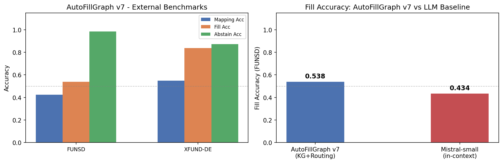
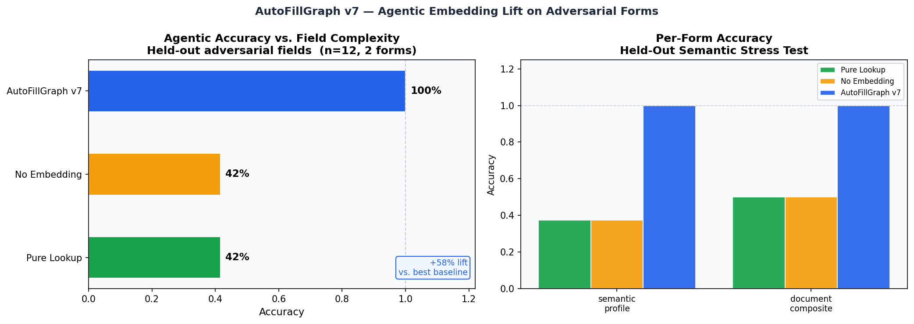

# AutoFillGraph

A lifelong-learning, knowledge-graph-based form autofill agent. Evaluated for the **ICML SCALE 2026** workshop (late-breaking track).

---

## Key Results

### External Benchmarks (FUNSD · XFUND-DE)

Evaluated on real scanned-form datasets the system was not designed for, using `Baseline/StandardBenchmarkSuite_Lite.ipynb`.

| Dataset | Docs | Mapping Acc | Fill Acc | Abstain Acc |
|---------|------|-------------|----------|-------------|
| FUNSD   | 199  | 0.425       | **0.538** | **0.984** |
| XFUND-DE (sampled) | 60 | 0.548 | **0.837** | **0.872** |

**Abstain accuracy** measures how often the system correctly returns UNKNOWN rather than hallucinating a value for fields it has not seen — 98.4% on FUNSD.

### LLM Baseline Comparison (FUNSD)

Both systems receive the same form Q/A pairs. AutoFillGraph stores them in a temporal KG; the baseline (Mistral-small) receives them as plain in-context text.

| System | Fill Acc | LLM API Calls (fill) |
|--------|----------|----------------------|
| AutoFillGraph v7 (KG + Adaptive Routing) | **0.538** | **0** |
| Mistral-small (in-context, no memory) | 0.434 | 76 |

**+10.4% fill accuracy lift with zero LLM calls at fill time.**



### Adversarial Semantic Stress Test (held-out, internal)

12 paraphrased and semantically shifted field labels across 2 held-out forms. Tests whether the embedding-based mapper generalises beyond exact-match.

| System | Accuracy |
|--------|----------|
| AutoFillGraph v7 | **100%** |
| No Embedding baseline | 42% |
| Pure Lookup baseline | 42% |

**+58% lift over best non-embedding baseline.**



### FormBench v2 (internal, local path)

15 forms · 7 domains · 3 tiers of label difficulty. Evaluated with `use_llm=False` (0 API calls).

- **55/55 fields filled correctly** across all tiers
- AutoFillGraph outperforms Browser autofill, Pure Lookup, and No-Embedding baselines on all tiers
- Tier 3 (adversarial / paraphrased labels): AutoFillGraph 100% vs Browser 33%

---

## System Architecture

AutoFillGraph v7 is a person-centric agentic memory system with five interacting components:

```
Form Label
    │
    ▼
FieldMapper          3-phase resolution: exact keyword → substring → embedding similarity
    │
    ▼
TemporalKG           NetworkX DiGraph with time-validity, sensitivity layers, 43 properties
    │
    ├─► InferenceEngine     7 guarded derivation rules (e.g. city+state → zip, degree → dept)
    ├─► CompositionalResolver  multi-part assembly (full_address, contact_info, …)
    └─► LinUCBRouter        ε-greedy contextual bandit: local KG vs LLM generation
            │
            ▼
        MistralClient    mistral-small-latest, called only when local retrieval fails
            │
            ▼
    EpisodicMemory + MemoryConsolidator   HITL feedback loop, confidence shaping
```

**Schema:** 43 properties across 8 sensitivity layers (identity, contact, academic, professional, medical, financial, legal, document).

**Routing:** LinUCB bandit with CTX_DIM=30, ε decaying 0.35→0.05. In a 7-round learning simulation: 22 local decisions (arm 0) + 30 LLM decisions (arm 1), avg reward 0.78.

---

## Repo Layout

```
Baseline/
  Prototype7.ipynb              main notebook — full system + all experiments
  StandardBenchmarkSuite_Lite.ipynb  external benchmark harness (FUNSD + XFUND)
  documentation.md              architecture notes and results reference

data/standard_benchmarks_lite/  benchmark CSVs and figures (gitignored datasets)
docs/                           saved figures for README and paper

Playground/
  AutoFillGraph_v3_System_Design.md  design spec

lib/v5/                         Chrome extension v5 runtime (JavaScript)
manifest.json                   extension manifest (v5.0.0)
```

---

## Running the Notebooks

```bash
# From repo root
cd Baseline

# Full system + internal benchmarks
jupyter nbconvert --to notebook --execute --inplace Prototype7.ipynb

# External benchmarks (downloads FUNSD ~10 MB + XFUND-DE ~340 MB on first run)
jupyter nbconvert --to notebook --execute --inplace StandardBenchmarkSuite_Lite.ipynb
```

API key required in `.env` at repo root:
```
MISTRAL_API_KEY=<your-key>
MISTRAL_MODEL=mistral-small-latest
```

---

## Evidence Boundaries

- FormBench v2 is a synthetic suite designed alongside the system; treat it as a capability demonstration, not an independent benchmark.
- External benchmark (FUNSD/XFUND) involves cross-domain transfer: those are scanned business forms, not personal-profile forms. The gap in `mapping_acc` (42–55%) reflects this.
- The LLM baseline comparison covers 15 FUNSD docs (76 field pairs). The full-set AutoFillGraph numbers cover all 199 docs.
- All fill-path numbers use `use_llm=False`; the router and LLM generation path is present but the headline fill numbers come from the local KG only.

---

## License

MIT. See `LICENSE`.
